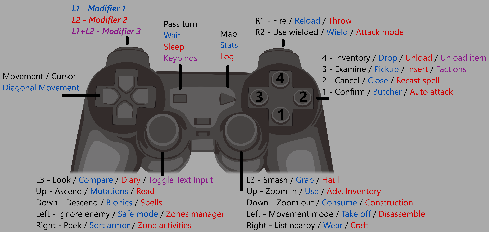

# Cataclysm: Dark Days Ahead - for gamepad

This is a fork of Cataclysm: Dark Days Ahead that I develop in order to play primarily on gamepad. Most anything that was keyboard-centric was removed or adapted towards gamepad.
* No external programs required!
* Remappable buttons, with up to 71 buttons with the modifiers.
* On-screen prompts for gamepad.
* Option for preferred button prompt style (PlayStation, Xbox, Nintendo).
* Ability to input text, numbers and necessary symbols.

## Base Controls

Controller image attribution -> [Playstation Controller PNGs by Vecteezy](https://www.vecteezy.com/free-png/playstation-controller)

    

When in Text Input mode:
* Up/Down - Cycle through characters
* Left/Right - Cursor position
* L1/L2 - Hold to select capital letters
* 4 - Space
* 3 - Backspace
* 2 - Cancel, end Text Input mode
* 1 - Accept, end Text Input mode

## Downloads

**Releases** - [Check them out here](https://github.com/Kilvoctu/Cataclysm-DDA/releases)

**Source** - The source can be downloaded as a [.zip archive](https://github.com/Kilvoctu/Cataclysm-DDA/archive/master.zip), or cloned from this [GitHub repo](https://github.com/Kilvoctu/Cataclysm-DDA/).

## Q&A

#### Why is my gamepad not working? / Why can't I see button prompts in-game?

Please ensure your gamepad is on and connected to your machine before starting the game, and that `Enable joystick` is set to `True` in Options -> Interface -> Control options. Make sure Text Input mode is not active (you can press `B`/`Circle` to cancel it).

#### Why can't I type into a input field using Text Input mode?

If it's an ImGui window, the current implementation of inputting text doesn't support it yet.

#### Why don't my buttons match the on-screen prompts?

Use an XInput gamepad.

#### Can I swap the dpad and left analog stick?

Not at this time, unfortunately.

#### What do the &#x23F8; (pause) and &#x23F5; (play) button prompts mean?
That is `Back`/`Select` and `Start`, respectively. I chose symbols because the text takes too much space.

#### How can I check and change the button mappings?

Press the `Back`/`Select` button while holding down `LB`/`L1` and `LT`/`L2` to see the a list of commands. When altering mappings, press up/down to select the command that you want, then press `X`/`Square`, then the desired button or button combination.

#### Where is the 0.H Stable version?

I have a 0.H branch that has rudimentary gamepad support, but it requires a 3rd-party software that can map gamepad buttons to keyboard keys. Backporting current features is possible, but I don't play 0.H..

#### Can I make a suggestion or send feedback?

Post your thoughts in [the discussions](https://github.com/Kilvoctu/Cataclysm-DDA/discussions) board. Keep in mind this fork is how I personally play C:DDA, so if someone is like, "I want UI support for my HOTAS" probably they're on their own.